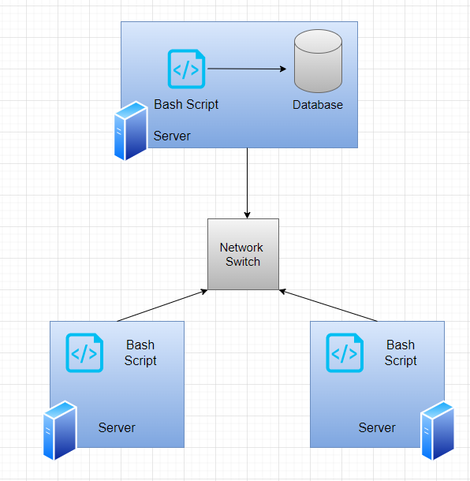

# Introduction
The purpose of this project is to monitor a cluster of 10 servers running CentOS 7. The servers can communicate via IPv4 addresses and are internally connected via a network switch. Two major types of data are recorded: hardware specifications for each node and node resource usage. These types of data will be collected using the `host_info.sh` and `host_usage.sh` files respectively. Data will then be collected using a crontab, and then stored in an RDBMS database using a PostgreSQL instance provisioned via a docker container. This project is used by the Jarvis Linux Cluster Administration (LCA) Team to answer various business-associated questions about the cluster as well as to improve its future resource planning.

# Quick Start
``` bash
# Create and start PSQL instance 
./scripts/psql_docker.sh create db_username db_password
./scripts/psql_docker.sh start

# Create tables using ddl.sql
psql -h localhost -U postgres -d host_agent -f sql/ddl.sql

# Insert hardware specs data into the DB using host_info.sh
./scripts/host_info.sh localhost 5432 host_agent postgres password

# Insert hardware usage data into the DB using host_usage.sh
./scripts/host_info.sh localhost 5432 host_agent postgres password

# Crontab setup for every minute
* * * * * bash /pwd/scripts/host_useage.sh localhost 5432 host_usage postgres password
```

# Implementation
The project will be implemented by using Docker to create a PSQL instance. A database of 2 tables will be used. The first table will be used for host information and the second for host usage information. The latter will be collected every minute using the crontab. Then 3 queries from the `sql/queries.sql` file will be executed to obtain data on group hosts by hardware information, average memory usage, and detecting host failure.

## Architecture


## Scripts
Shell script description and usage:

- `psql_docker.sh`
  Creates starts or stops Docker container using the PSQL instance

``` bash
./scripts/psql_docker.sh create db_username db_password
./scripts/psql_docker.sh start | stop
```

- `host_info.sh`
  Collects host hardware information and then inserts it into the host_info table of the host_agent database.

``` bash
./scripts/host_info.sh psql_host psql_port db_name psql_user psql_password
```

- `host_usage.sh`
  Collects host usage information and then inserts it into the host_usage table of the host_agent database.

``` bash
./scripts/host_info.sh psql_host psql_port db_name psql_user psql_password
```

- `crontab`
  Use crontab to execute `host_usage.sh` every minute

``` bash
crontab -e
* * * * * bash /pwd/scripts/host_useage.sh localhost 5432 host_usage postgres password
> /tmp/host_usage.log
``` 

- `queries.sql`
  Perform 3 queries:
1. Group hosts by hardware information
2. Determine average memory usage
3. Detect host failure

## Database Modeling
Schema for `host_info` and `host_usage` table:

### Host Info Table

|	Name	 |	Type	 |	Constraint	 |
|--------------- |---------------|-----------------------|
|	id	 |    SERIAL	 |	PRIMARY KEY	 |
|    hostname    |    VARCHAR    |	NOT NULL UNIQUE  |
|    cpu_number  |    INTEGER    |	NOT NULL	 |
|cpu_architecture|    VARCHAR	 |      NOT NULL	 |
|   cpu_model    |    REAL	 |      NOT NULL	 |
|   L2_cache	 |    INTEGER	 | 	NOT NULL	 |
|   total_mem	 |    INTEGER    |      NOT NULL	 |
|   timestamp	 |    TIMESTAMP  | 	NOT NULL	 |


### Host Usage Table

|	Name	 |	Type	 |	Constraint	 	      |
|--------------- |---------------|------------------------------------|
|    timestamp	 |    TIMESTAMP  |	NOT NULL	 	      |
|    host_id     |    SERIAL     | NOT NULL REFERENCES host_info(id)  |
|    memory_free |    INTEGER    |	NOT NULL	 	      |
|    cpu_idle    |    INTEGER	 |      NOT NULL	              |
|   cpu_kernel   |    INTEGER	 |      NOT NULL	              |
|   disk_io	 |    INTEGER	 | 	NOT NULL	              |
| disk_available |    INTEGER    |      NOT NULL	              |


# Test
Each bash script was tested individually, the results were inspected and the queries were improved upon iteratively.

# Deployment

The GitHub repository contains the necessary files for deployment.
Crontab was used to ensure the `host_useage.sh` file was executed every minute.
Docker was used to establish a PSQL instance to store the necessary database.

# Improvements

- Handle hardware updates and update the table as necessary
- Add additional columns within the host info and host usage table to obtain a greater evaluation for efficiency
- Obtain additional information regarding the host failure, if there is one